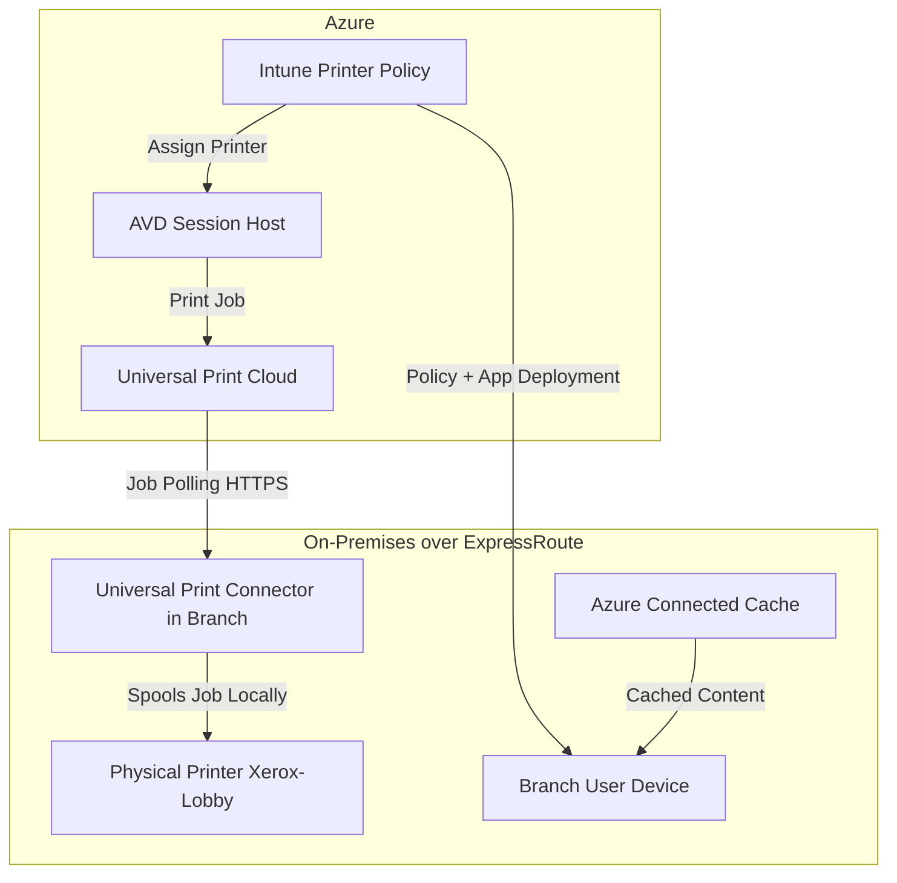
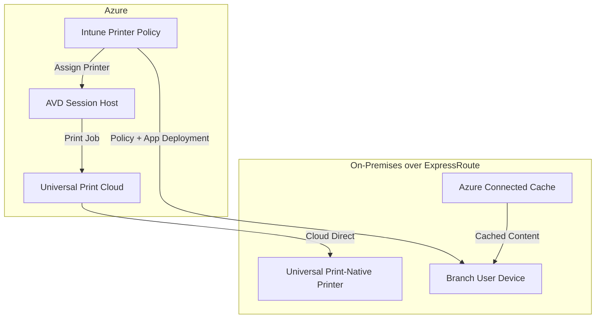

# Universal Print - Print Team Module

This Terraform setup provisions Universal Print infrastructure across multiple subscriptions and domains in accordance with Microsoft's enterprise landing zone architecture.

---
### Documentation:
- [🔑 Get access to Universal Print / Pricing](https://learn.microsoft.com/en-us/universal-print/get-access-to-universal-print?pivots=segment-commercial)
- [⏩ Migrating to Universal Print from an on-premises solution](https://learn.microsoft.com/en-us/universal-print/migrating-from-on-prem)
- [📝 Plan your architecture](https://learn.microsoft.com/en-us/universal-print/plan-your-architecture)
- [⚙️ Set up Universal Print](https://learn.microsoft.com/en-us/universal-print/set-up-universal-print)
- [🎬 Demo](https://regale.cloud/microsoft/play/1265/universal-print#/0/0)
- [🎯 Intune](https://learn.microsoft.com/en-us/universal-print/fundamentals/universal-print-intune-tool)
---

## Overview

This module automates the provisioning and configuration of printers for Azure Virtual Desktop (AVD) and traditional cloud-first environments using Microsoft Universal Print. It follows a domain-driven design where print-related resources are separated into their own team domain under `azure/print`.

## Subscriptions Used

The solution is designed to span across the following Azure subscriptions:

- **Management Subscription**
  - Centralized logging (e.g., Log Analytics)
  - Policy management
  - Azure Update Manager
  - Defender for Cloud

- **Identity Subscription**
  - Azure AD group management
  - Role-based access control (RBAC)
  - Group-based printer assignment

- **Landing Zone Subscription (e.g., P1, A2)**
  - Universal Print Connector VM deployments
  - Site-specific or region-specific printer resources

## Module Inputs

Printers are defined using `printers.auto.tfvars` and support the following structure:

```hcl
printers = [
  {
    name           = "Xerox-Lobby"
    location       = "1st Floor Lobby"
    connector_name = "print-connector-01"
    group_access   = ["print-users", "hr-staff"]
    driver_name    = "Xerox Global Print Driver PCL6"
    ip_address     = "10.0.1.25"
    floor          = "1"
    model          = "Xerox VersaLink C405"

    # Optional print queue settings
    duplex_mode    = "twoSidedLongEdge"  # Options: oneSided, twoSidedLongEdge, twoSidedShortEdge
    color_mode     = "monochrome"        # Options: color, monochrome
    paper_size     = "A4"
    tray_default   = "Tray1"
  }
]
```

> **Note:** Optional print queue settings (e.g., duplex, color mode, paper size) can be defined here and applied through post-deployment automation using PowerShell, Graph API, or DSC.

## How It Works

- The module loops through all printer definitions and provisions group access using the AzureAD provider.
- A placeholder `null_resource` is used for future integration with:
  - DSC scripts
  - PowerShell printer registration
  - Microsoft Graph API automation

### Architecture: With Connector in Branch



### Architecture: Native Printer (No Connector)



> **Note:** If your printers natively support Microsoft Universal Print (like the Xerox AltaLink 8155), you do **not** need a connector. This is the preferred architecture for future-proofing and simplifies deployment by allowing printers to register and communicate directly with the Universal Print service in Azure. Use the connector only for legacy printers that do not support native Universal Print functionality.

## Future Enhancements

- Replace `null_resource` with automated Universal Print registration (via Graph or PowerShell)
- Integrate monitoring and logging with centralized dashboards
- Build Intune printer deployment profiles dynamically from Terraform data
- Use PowerShell and Graph API to apply default print queue settings (e.g., duplex, grayscale, tray selection)
- Use DSC to configure local printer preferences and drivers on Connector VMs
- Implement high availability by deploying multiple connectors per site with load-balanced registration
- Enable Universal Print job tracking and alerting via Log Analytics and Azure Monitor
- Provide Terraform output integration for Intune Configuration Profile generation
- Extend the module to support hybrid environments with mixed native and non-native printers
- Add branch-level tagging and metadata for region-aware routing and reporting

## Cost Considerations

Universal Print is licensed through Microsoft 365 and does not charge per-page printing fees. However, it's important to account for the following cost elements when planning deployment across branch environments:

- **Universal Print Licensing**  
  Requires Microsoft 365 subscriptions that include Universal Print (e.g., Microsoft 365 E3/E5, A3/A5). Each license includes a number of print jobs per user per month.

- **Printer Hardware**  
  Native Universal Print-compatible printers (e.g., Xerox AltaLink 8155) may carry a higher initial cost, but reduce infrastructure complexity and management overhead by eliminating the need for a connector.

- **Connector Infrastructure**  
  If using non-native printers, plan for the cost of a VM or small desktop device per branch to host the Universal Print Connector. This includes:
  - Windows licensing (if applicable)
  - Hardware (NUC, Micro PC, etc.)
  - Ongoing patching and monitoring

- **Network Egress (Minimal)**  
  Print job delivery to the connector from Universal Print is over HTTPS and typically small in size. Bandwidth costs are minimal, especially over ExpressRoute.

- **Monitoring and Logging (Optional)**  
  If integrating with Log Analytics or Azure Monitor for Universal Print job tracking and connector health, expect associated data ingestion costs.

- **Azure Connected Cache (Optional)**  
  If co-located on the same device, Azure Connected Cache can improve Intune and Microsoft content delivery, but requires Docker and at least 2 TB of available disk space for production scenarios.

Evaluating these costs can help determine whether native printers or connector-based deployment is more cost-effective long-term for each site.

## Dependencies

- Azure AD tenant with Universal Print licensing
- Universal Print Connector VM (if using non-native printers)
- Access to the required subscriptions and RBAC roles

## Intune Integration

Although this module doesn't deploy printers directly to end-user devices, Intune is the recommended method for provisioning Universal Print printers to Azure AD-joined devices and Azure Virtual Desktop (AVD) environments.

Once a printer is provisioned and shared via this module:
- Intune can deploy the printer to users based on Azure AD group membership (defined here)
- This ensures seamless printer mapping for users without relying on legacy GPOs
- It supports modern endpoint management and works well with FSLogix for AVD scenarios

For future enhancements, Intune Configuration Profiles can be dynamically generated based on Terraform-managed printer definitions.