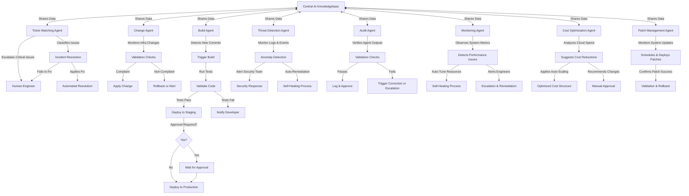

# AI Ops System

## Overview
The AI Ops System is designed to automate IT operations by leveraging AI-driven agents for monitoring, incident resolution, change management, and deployment automation. Each agent utilizes a specialized **Retrieval-Augmented Generation (RAG)** model tailored to its domain, ensuring optimized performance and decision-making. These agents all interact with a **Central AI Knowledgebase** that serves as the system's collective intelligence.

## Agent Workflow

## Key Components

### 1. **Central AI Knowledgebase**
- Serves as a shared intelligence hub for all AI Ops agents.
- Stores historical incident resolutions, best practices, infrastructure policies, and security findings.
- Continuously updated with new insights from agent interactions and real-time data.
- Provides context-aware recommendations and decision-making support to agents.

### 2. **Ticket Watching Agent (Incident RAG)**
- Uses a **Retrieval-Augmented Generation (RAG)** model trained on historical IT tickets and resolutions.
- Monitors ticketing systems (e.g., ServiceNow, Jira).
- Classifies and resolves common issues automatically.
- Escalates complex problems to human engineers.

### 3. **Change Agent (Infrastructure RAG)**
- Uses a **RAG model trained on Terraform, Pulumi, and infrastructure policies.**
- Watches infrastructure changes and enforces compliance/security policies.
- Auto-applies or rolls back changes based on validation results.

### 4. **Build Agent (CI/CD RAG)**
- Uses a **RAG model specialized in build pipeline optimizations and test case success rates.**
- Triggers CI/CD pipelines upon commit detection.
- Runs automated tests and deploys code.
- Handles approvals for production deployments.

### 5. **Threat Detection Agent (Security RAG)**
- Uses a **RAG model trained on security logs, attack patterns, and anomaly detection data.**
- Monitors logs and system events for security threats.
- Uses AI-based anomaly detection.
- Triggers security alerts or auto-remediates threats.

### 6. **Audit Agent (Compliance RAG)**
- Uses a **RAG model based on regulatory compliance, best practices, and internal policies.**
- Continuously validates the actions of other agents.
- Ensures compliance with best practices and security policies.
- Logs verification results and triggers corrective actions when necessary.

### 7. **Monitoring Agent (Performance RAG)**
- Uses a **RAG model trained on historical system performance and incident data.**
- Observes CPU, memory, network, and application metrics.
- Auto-tunes resources to prevent failures and degradation.
- Alerts engineers if anomalies exceed thresholds.

### 8. **Cost Optimization Agent (Cloud Efficiency RAG)**
- Uses a **RAG model trained on cloud spend, usage patterns, and optimization techniques.**
- Analyzes cloud expenses and detects inefficiencies.
- Recommends cost-saving measures like reserved instances, auto-scaling, or right-sizing.
- Suggests infrastructure adjustments based on workload trends.

### 9. **Patch Management Agent (System Update RAG)**
- Uses a **RAG model trained on OS and application patch data.**
- Monitors for critical security and feature updates.
- Schedules and deploys patches with minimal downtime.
- Validates patch success and rolls back if needed.

## Future Enhancements
- **Self-learning AI models** to improve issue resolution.
- **AI-driven cost optimization** for cloud infrastructure.
- **Autonomous IT governance** with policy enforcement.
- **Federated RAG models** that continuously refine their understanding from real-time data.
- **Advanced Root Cause Analysis Agent** to determine why failures occur and prevent recurrence.
- **Inter-Agent Communication Layer** for real-time cross-agent collaboration.

---
This AI Ops System provides a scalable and intelligent way to manage IT operations with minimal human intervention, leveraging domain-specific **RAG models** and a **Central AI Knowledgebase** for enhanced decision-making. 🚀
