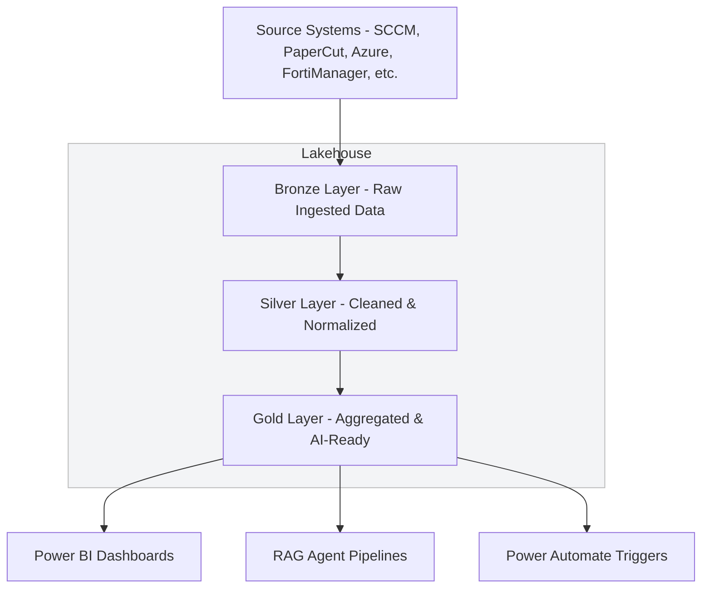
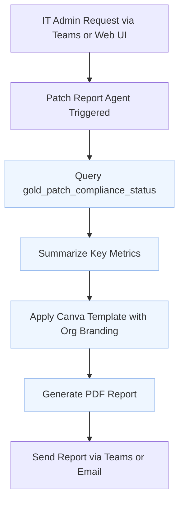
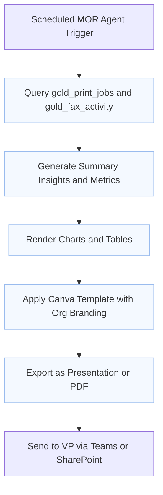
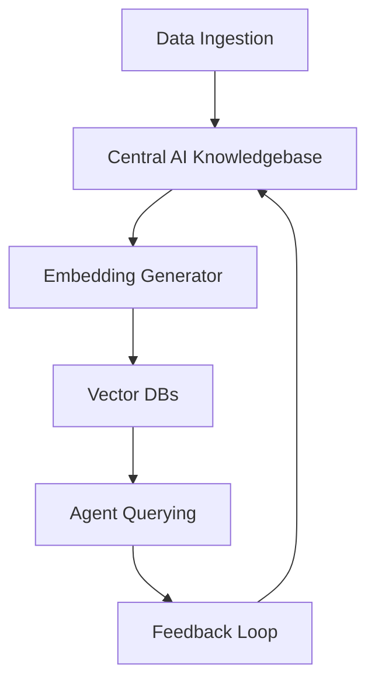
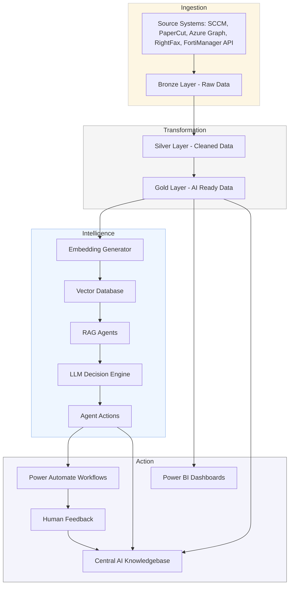
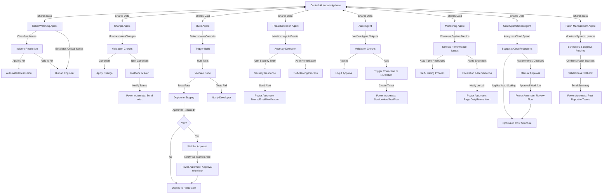

# AI Ops System

## Overview
The AI Ops System is designed to automate IT operations by leveraging AI-driven agents for monitoring, incident resolution, change management, and deployment automation. Each agent utilizes a specialized **Retrieval-Augmented Generation (RAG)** model tailored to its domain, ensuring optimized performance and decision-making. These agents all interact with a **Central AI Knowledgebase** that serves as the system's collective intelligence.

## RAG Model Architecture
Each agent is backed by a domain-specific Retrieval-Augmented Generation (RAG) model pipeline. This pipeline typically uses LangChain for orchestration, calling an LLM (such as GPT-4, Claude, or Llama2 via Ollama) alongside a vector store like FAISS, Milvus, or Azure AI Search. These RAG models are updated continuously from the Central AI Knowledgebase, allowing each agent to make context-aware decisions with minimal latency.

## Data Flow Overview
1. Source data (logs, metrics, configs) flows into a central Data Lake (e.g., Delta Lake or Azure Blob Storage).
2. Databricks ETL pipelines process and normalize this data into Bronze, Silver, and Gold layers.
3. Agents query structured data and their own vector stores for semantic matching and historical insights.
4. LLMs generate suggested actions or decisions.
5. Power Automate executes workflows or approvals based on agent decisions.
6. Agent outcomes and human feedback are recorded back into the Central AI Knowledgebase for learning.

## Databricks Lakehouse Architecture

Databricks serves as the **data backbone** for the AI Ops system. It implements a **Lakehouse pattern**, combining the flexibility of a data lake with the performance and structure of a data warehouse.

## Layer-by-Layer Operations

This section details what happens in each data layer and where operations occur — from raw ingestion to AI agent reasoning.

### 🟫 Bronze Layer – Raw Ingested Data

**Purpose:** Capture source data exactly as-is, unfiltered and untransformed.

| Operation       | Performed In                        | Notes |
|----------------|--------------------------------------|-------|
| API Calls       | Power Automate, Azure Functions, Databricks notebooks | E.g., FortiManager, Azure Resource Graph, SCCM |
| File Landing    | Azure Blob or ADLS Gen2              | CSV, JSON, XML, logs |
| Ingestion       | Databricks Auto Loader / Notebooks   | Monitors and ingests to Delta format |
| Schema Inference| Databricks                           | Initial pass or enforced schema |

### 🟪 Silver Layer – Cleaned & Normalized

**Purpose:** Harmonize and refine raw data into structured, usable datasets.

| Operation        | Performed In      | Notes |
|-----------------|-------------------|-------|
| Data Transformation | Databricks     | Clean nulls, format timestamps |
| Deduplication    | Databricks        | E.g., duplicate logs from SCCM |
| Joins & Merging  | Databricks SQL/PySpark | E.g., Join FortiManager data to Azure inventory |
| Normalization    | Databricks        | Ensure type consistency, units, formats |
| Masking (PII)    | Optional, Databricks | Compliance-ready data pipelines |

### 🟨 Gold Layer – AI-Ready & Business Logic

**Purpose:** Produce analytics-ready and ML-compatible datasets.

| Operation           | Performed In        | Notes |
|--------------------|---------------------|-------|
| Aggregation         | Databricks SQL      | KPIs like patch % or drift scores |
| Feature Engineering | Databricks          | E.g., Days since last reboot |
| Embedding Generation| Databricks / LangChain | Used in RAG pipelines |
| Delta Table Publishing | Databricks SQL Endpoint | Queried by Power BI, agents |
| Workflow Triggers   | Databricks Workflows | Rebuild daily/hourly tables |

### 🧠 Central AI Knowledgebase

**Purpose:** Power agent decision-making with semantic search and AI memory.

| Operation         | Performed In                     | Notes |
|------------------|-----------------------------------|-------|
| Embeddings        | LangChain, Databricks            | Converts text/tables to vector format |
| Search/Querying   | Vector DB (Milvus, FAISS, Azure AI Search) | Used by RAG agents |
| Feedback Ingestion| Databricks / Power Automate      | Close loop learning |
| Semantic Updates  | LangChain / Agent logic          | Adds/upserts new documents or agent results |

## Data Strategy Diagram

## Example Flow: IT Admin Patch Report Request

This flow illustrates how an IT admin can request a patch compliance report. The system pulls relevant data from the Gold Layer, formats the report using a Canva template with the organization's branding, and returns a visually polished PDF with insights.

This enables non-technical users to get high-quality, decision-ready documents automatically, combining AI-generated insights with visual polish.

## Example Flow: Monthly MOR for Faxing and Printing

This flow illustrates how the system automatically generates a Monthly Operational Report (MOR) for faxing and printing. The agent queries Gold Layer tables, summarizes metrics, applies branding through a Canva template, and delivers a polished presentation or PDF for executive consumption.

This allows stakeholders to receive visually rich, up-to-date reporting that blends automation with storytelling and professional design.
 
## Central AI Knowledgebase Flow
 

## Full System Architecture

### 🧪 Real-time & Streaming Support

- **Structured Streaming** can be used for near-real-time metrics (e.g., FortiManager event streams).
- Lakehouse allows agents to access both **batch and live data** with a unified query interface.

### 📡 Access Model

- **Power BI** connects directly to Gold tables via **Databricks SQL endpoints**.
- **RAG Agents** pull data from Delta tables and embed key outputs into their vector DBs.
- **Power Automate** uses webhook triggers to kick off Databricks jobs if needed.

### 📁 Suggested Table Naming Convention

| Layer  | Prefix   | Example                          |
|--------|----------|----------------------------------|
| Bronze | `bronze_` | `bronze_rightfax_logs`          |
| Silver | `silver_` | `silver_patch_summary`          |
| Gold   | `gold_`   | `gold_cost_efficiency_scores`   |

## Agent Workflow

## Key Components

### 1. **Central AI Knowledgebase**
- Serves as a shared intelligence hub for all AI Ops agents.
- Stores structured, semi-structured, and vectorized knowledge across operational domains.
- Powers all RAG pipelines with relevant context, policies, historical actions, and documentation.
- Continuously updated with new insights from agent interactions and real-time data.
- Provides context-aware recommendations and decision-making support to agents.
- Integrates with vector databases to enable semantic retrieval.
- Supports incremental retraining of agent-specific models and reinforcement from human feedback.

### 2. **Ticket Watching Agent (Incident RAG)**
- Uses a **Retrieval-Augmented Generation (RAG)** model trained on historical IT tickets and resolutions.
- Monitors ticketing systems (e.g., ServiceNow, Jira).
- Classifies and resolves common issues automatically.
- Escalates complex problems to human engineers.

### 3. **Change Agent (Infrastructure RAG)**
- Uses a **RAG model trained on Terraform, Pulumi, and infrastructure policies.**
- Watches infrastructure changes and enforces compliance/security policies.
- Auto-applies or rolls back changes based on validation results.

### 4. **Build Agent (CI/CD RAG)**
- Uses a **RAG model specialized in build pipeline optimizations and test case success rates.**
- Triggers CI/CD pipelines upon commit detection.
- Runs automated tests and deploys code.
- Handles approvals for production deployments.

### 5. **Threat Detection Agent (Security RAG)**
- Uses a **RAG model trained on security logs, attack patterns, and anomaly detection data.**
- Monitors logs and system events for security threats.
- Uses AI-based anomaly detection.
- Triggers security alerts or auto-remediates threats.

### 6. **Audit Agent (Compliance RAG)**
- Uses a **RAG model based on regulatory compliance, best practices, and internal policies.**
- Continuously validates the actions of other agents.
- Ensures compliance with best practices and security policies.
- Logs verification results and triggers corrective actions when necessary.

### 7. **Monitoring Agent (Performance RAG)**
- Uses a **RAG model trained on historical system performance and incident data.**
- Observes CPU, memory, network, and application metrics.
- Auto-tunes resources to prevent failures and degradation.
- Alerts engineers if anomalies exceed thresholds.

### 8. **Cost Optimization Agent (Cloud Efficiency RAG)**
- Uses a **RAG model trained on cloud spend, usage patterns, and optimization techniques.**
- Analyzes cloud expenses and detects inefficiencies.
- Recommends cost-saving measures like reserved instances, auto-scaling, or right-sizing.
- Suggests infrastructure adjustments based on workload trends.

### 9. **Patch Management Agent (System Update RAG)**
- Uses a **RAG model trained on OS and application patch data.**
- Monitors for critical security and feature updates.
- Schedules and deploys patches with minimal downtime.
- Validates patch success and rolls back if needed.

### 10. **Identity Guard Agent (IAM RAG)**
- Uses a RAG model trained on access logs, IAM policy rules, and zero-trust security principles.
- Monitors role assignments, permissions drift, and user behavior anomalies.
- Suggests revocations or role optimizations.
- Integrates with Azure AD, AWS IAM, or Okta for enforcement.

## Observability & Feedback
- Agent outputs, decisions, and performance metrics are logged to a central observability platform (e.g., Azure Monitor, Grafana, or Loki).
- Failures and escalations are tagged and reviewed for model refinement or policy changes.
- Human engineers can provide feedback directly in ticket systems or Power Automate to help reinforce future decisions.
- Future versions will support Reinforcement Learning from Human Feedback (RLHF) for agents.

## Future Enhancements
- **Self-learning AI models** to improve issue resolution.
- **AI-driven cost optimization** for cloud infrastructure.
- **Autonomous IT governance** with policy enforcement.
- **Federated RAG models** that continuously refine their understanding from real-time data.
- **Advanced Root Cause Analysis Agent** to determine why failures occur and prevent recurrence.
- **Inter-Agent Communication Layer** for real-time cross-agent collaboration.

## Appendix: Tech Stack
- **LLM**: GPT-4, Claude 3, Llama2 (Ollama)
- **Vector DB**: Milvus, FAISS, Azure AI Search
- **ETL/Analytics**: Databricks (Delta Lake)
- **Agent Orchestration**: LangChain, LangGraph
- **Automation**: Power Automate, Azure Functions
- **Infrastructure**: Terraform, Pulumi
- **Monitoring**: Azure Monitor, Grafana, Loki
- **Visualization**: Power BI, Mermaid

---
This AI Ops System provides a scalable and intelligent way to manage IT operations with minimal human intervention, leveraging domain-specific **RAG models** and a **Central AI Knowledgebase** for enhanced decision-making. 🚀
