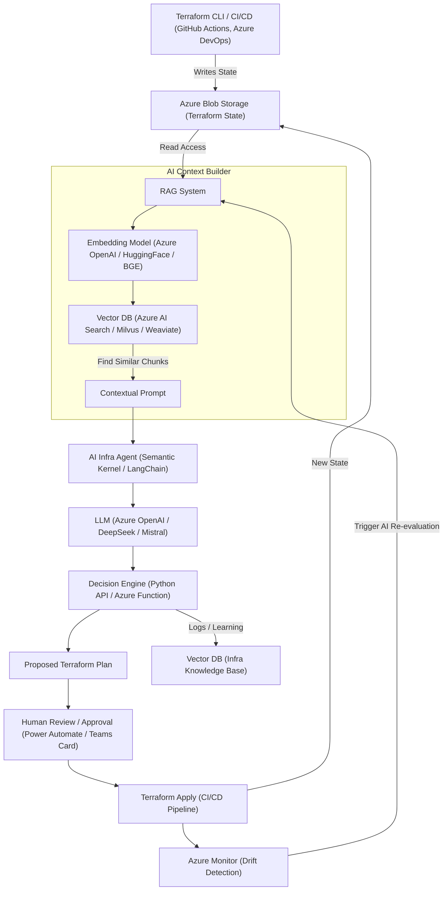

# 🚀 Future-Proofing Infrastructure for AI with Azure + Terraform

## 🧭 Architecture Overview

This architecture leverages **Azure-native services** and open-source AI frameworks to build an intelligent, modular infrastructure pipeline that’s ready for AI-powered operations — today and into the future.

---

## ✅ Why Azure Blob Storage Wins for Terraform State

- **Full Control**  
  Manage access, versioning, encryption, and auditing through native Azure tools (RBAC, Key Vault, Logging).

- **AI-Ready for RAG Systems**  
  Terraform state is directly accessible and structured — ideal for AI pipelines using Retrieval-Augmented Generation (RAG), enabling LLMs to query infrastructure state for drift detection, compliance insights, and dynamic recommendations.

- **Vendor Agnostic & Portable**  
  No dependency on HashiCorp’s managed backend; your data stays in your cloud.

- **Composable & Modular**  
  Easily integrates with LangChain, Semantic Kernel, Milvus, Weaviate, or Azure AI Studio components.

- **Aligned with Enterprise Governance**  
  Centralized billing, policy enforcement, and security — aligned with your existing Azure landing zone.

---

## 🔍 Comparison Table

| Criteria               | **Azure Blob Storage**                                 | **HCP Terraform**                     |
|------------------------|--------------------------------------------------------|---------------------------------------|
| Direct File Access     | ✅ Yes                                               | ❌ No                                 |
| AI Integration Ready   | ✅ Best for RAG, Embeddings, LLM Queries              | ⚠️ API-access only, not suitable for RAG |
| RBAC & Policy Control  | ✅ Azure-native                                       | ❌ Managed separately                 |
| Cost / Billing Control | ✅ Unified under Azure subscription                   | ⚠️ Separate cloud billing             |
| Lock-in Risk           | ❌ None                                               | ⚠️ Moderate                           |
| Enterprise Integration | ✅ Works with Azure Monitor, AI                       | ⚠️ Limited outside Terraform          |
| AI Autonomy & Deep Reasoning | ✅ Direct access supports full AI automation   | ❌ Restricted to Terraform Cloud logic |

---

## 🔑 Key Message

> **We’re not just building infrastructure — we’re enabling an intelligent control plane.**  
> With Azure-native services and modular AI agents, we can **observe**, **reason about**, and **evolve** our infrastructure with confidence and control.

---

## 🧠 AI-Augmented Terraform Automation – Architecture

---

## 🧰 Tools to Implement This Flow

| Layer                      | Recommended Tooling                              |
|---------------------------|---------------------------------------------------|
| **State Storage**         | Azure Blob Storage                               |
| **Vector DB**             | Azure AI Search (native), Milvus, Weaviate       |
| **LLM**                   | Azure OpenAI, Ollama (local), Mistral, DeepSeek  |
| **Agent Framework**       | Semantic Kernel (Microsoft), LangChain           |
| **Reasoning Logic**       | Azure Functions, Container App, FastAPI backend  |
| **UI / Review Flow**      | Power Automate + Teams Adaptive Cards            |
| **Execution**             | GitHub Actions, Azure DevOps Pipelines           |
| **Monitoring**            | Azure Monitor + Logic Apps or Alerts             |

---

## 💡 Why This Approach Is Best Practice

- ✅ **Secure, governable, enterprise-ready**
- ✅ **Enables AI-driven infrastructure reasoning and automation**
- ✅ **Optimized for RAG-based querying of Terraform state**
- ✅ **Modular and open, ensuring long-term AI compatibility**
- ✅ **Keeps humans in the loop where needed**

---