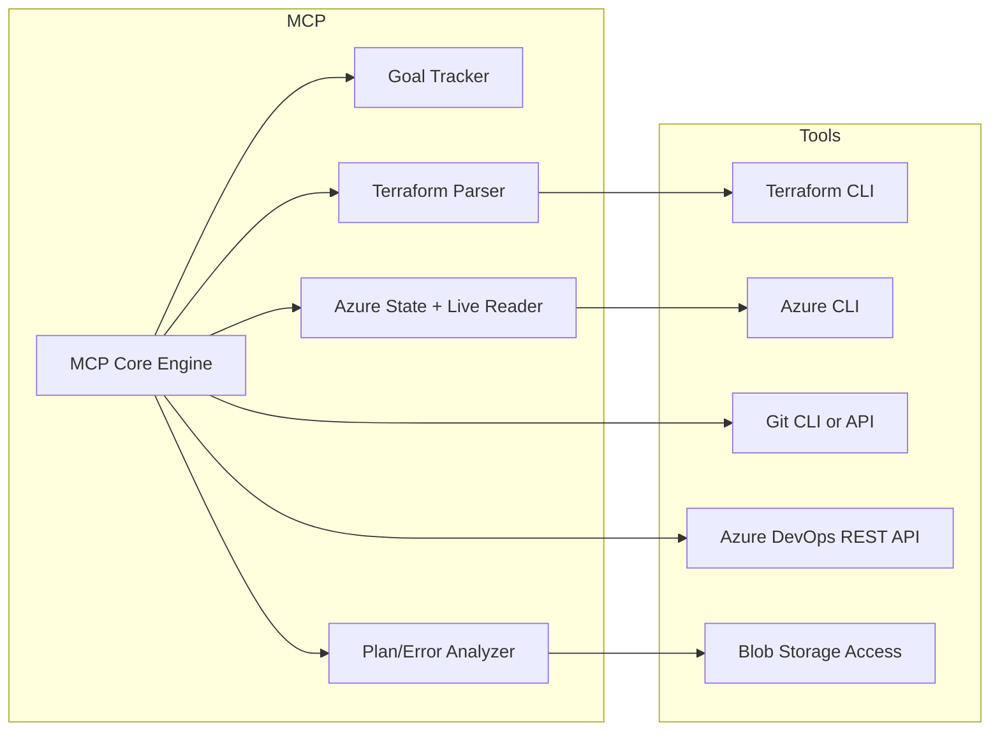
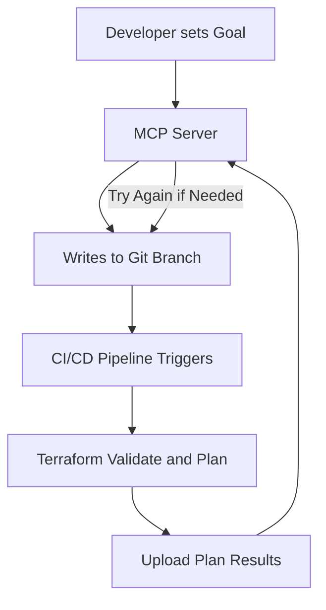
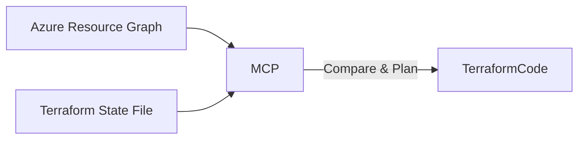

# Terraform MCP Workflow

This project is building a **Model Context Protocol (MCP)** workflow specifically designed to automate and iterate on **Terraform-based Azure infrastructure** deployments using a secure, self-improving loop.

## 🔍 Goal

To create an AI-assisted workflow that:
- Understands your existing Terraform code and environments
- Reads state from both Terraform and Azure live inventory
- Iteratively proposes Terraform changes
- Uses CI/CD to test and retry until goals are met
- Keeps a memory of goals, attempts, errors, and context

## 🧠 What is MCP?

A **Model Context Protocol** is a structured loop where an AI can:
1. Understand the current state of the environment
2. Act to change it (generate code, create pull requests)
3. Learn from the result (validation errors, plan diffs)
4. Iterate until successful

---

## 🧰 Tools and Interactions

The MCP will use a combination of tools and integrations to interact with Terraform, Azure, and CI/CD systems in a secure, automated fashion:

- **Terraform CLI**: Executes `terraform init`, `plan`, and `validate` during iteration loops.
- **Azure CLI / Azure SDK**: Queries live Azure resource data using tools like `az graph query` for inventory and drift detection.
- **Git CLI or API**: Creates branches, commits changes, and pushes to trigger CI pipelines.
- **Azure DevOps REST API**: Triggers pipelines and retrieves results to feed back into the MCP loop.
- **Blob Storage Access**: Reads and writes `.tfstate`, `.tfplan`, and result files for comparison and logging.
- **Internal Summary + Goal Tracker**: Keeps a structured memory of goals, current state, attempted fixes, and reasoning for future context.

These tools allow the MCP to operate as a fully autonomous Terraform operator, capable of understanding context, making decisions, and testing its own changes in a secure loop.

---

## 🏗️ High-Level Architecture

---

## ☁️ Azure Integration

---

## 🔐 Security Principles

- MCP is hosted inside your own Azure tenant
- Uses Managed Identity or secure Service Principal
- No write access to Azure — only propose and test
- Auto-apply is optional and gated by review

---

## 🛠️ Status

This is under active development. The following components are being built:

- [x] Terraform Labs Folder Structure
- [ ] MCP Server (Python + FastAPI)
- [ ] Azure DevOps Pipeline Support
- [ ] State Comparison Engine
- [ ] Azure Resource Awareness (via `az graph query`)
- [ ] Iterative Planner Loop

---

## 🚀 Coming Soon

A prototype where the MCP can propose Terraform changes and rerun Azure DevOps pipelines until it gets a valid plan that matches the user’s intent.

---
